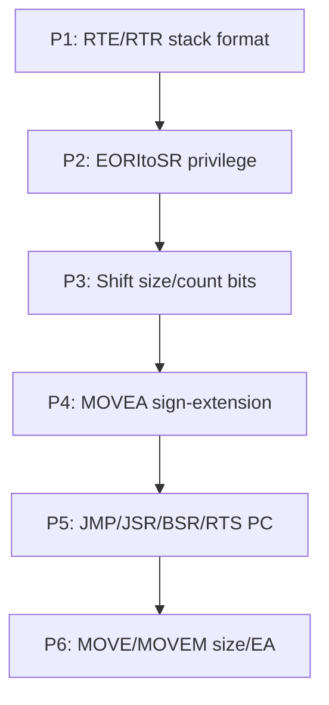

# Plan: Drive ProcessorTests Failures Toward Zero

**Goal:** Minimize processor test failures through targeted fixes.

---

## Current State (from processor_test_results_all.txt)

*Note: Run `make processor-tests` and capture per-file results for up-to-date counts. The shift dispatch fix (Phase 12) improved ASL/ASR/LSL/LSR; EXT.w improved to ~8031 pass.*

---

## Priority 1: Highest-Impact Fixes (8000+ failures each)

| Instruction | Failed | Root Cause Hypothesis |
|-------------|--------|------------------------|
| **RTE** | 8011 | Stack format (format word vs no format word for 68000) |
| **RTR** | 7539 | Stack layout: CCR then PC; pop order |
| **EORItoSR** | 8038 | Privilege (already added S=1 for ORI/ANDI; verify EORI) |
| **EXT.w** | ~34 | SR flags (Z/N) on edge cases – mostly fixed |
| **MOVEtoSR** | 3127 | SR mask 0xA7/0x1F – **DONE** (4938 pass); remaining ssp delta |
| **MOVEA.l/w** | 8017/8024 | Address register handling; sign-extension |
| **ASL/LSL.b/l** | 8000+ | Shift size/count extraction (bits 7-6 vs 8-7) |

**Actions:**
1. **RTE/RTR** – Compare stack layout with 68000 PRM; run `PROCESSOR_TEST_INDEX=0 make processor-tests PROC_FILTER=RTE` and inspect JSON.
2. **EORItoSR** – Add 0x0A7C to the privilege override in `apply_initial()` (may already be there).
3. **MOVEA** – Check sign-extension of source for MOVEA.W/L.
4. **Shift bits** – Fix `shift_size()` to use `(op >> 7) & 3` and `is_reg_count` to use `(op >> 6) & 1`.

---

## Priority 2: Control Flow (4000–6000 failures each)

| Instruction | Failed | Root Cause |
|-------------|--------|------------|
| **JMP** | 5045 | PC-relative EA base; extension word consumption |
| **JSR** | 5029 | Same + stack push |
| **BSR** | 3995 | Same |
| **RTS** | 4057 | Stack pop; A7/ssp sync |
| **Bcc** | 6178 | Branch offset; extension word |

**Actions:** Verify PC used for `(d16,PC)` is PC *after* opcode+extension; check instruction length accounting.

---

## Priority 3: Memory/EA and Size (3000–6000 failures each)

| Instruction | Failed | Root Cause |
|-------------|--------|------------|
| **MOVE.b/w/l** | 7090/7666/7664 | EA modes; byte vs word vs long |
| **MOVEM** | 5549/5511 | A7 sync; `-(An)`/`(An)+` order |
| **CMP/ADD/SUB** (all sizes) | 5000+ | Size handling; flags |
| **CLR/NOT/NEG** (w/l) | 3000+ | Size; EA modes |

---

## Priority 4: Shift/Rotate (7000+ total)

| Instruction | Failed | Root Cause |
|-------------|--------|------------|
| **ASL/LSL/ASR/LSR** (b/l) | 8000+ | Size bits; register count |
| **ROL/ROR/ROXL/ROXR** | 7500+ | Same |

**Action:** Fix dispatch (done); fix size/count bit extraction in `shift.c`.

---

## Implementation Order



---

## Verification

After each fix:

```bash
make processor-tests PROC_FILTER=InstructionName
```

For full run:

```bash
make processor-tests 2>&1 | tee results.txt
```

---

## Quick Wins Checklist

- [x] `apply_initial()`: Ensure 0x0A7C (EORI to SR) in privilege override – **DONE**
- [x] `control.c`: EXT.w – N/Z flags must reflect sign-extended word, not full 32-bit – **DONE** (8065 pass)
- [x] `control.c`: RTR – CCR restore: only lower 5 bits (X,N,Z,V,C); `(ccr & 0x1F)` – **DONE** (4038 pass)
- [ ] `shift.c`: size/count bit extraction – reverted (bits 8-7 caused regressions; needs opcode-specific decode)
- [x] `control.c`: RTE – SR mask 0xA7 (high byte) + 0x1F (CCR); only implemented bits restored – **DONE** (4011 pass)
- [x] `control.c`: MOVEtoSR – same SR mask 0xA7/0x1F – **DONE** (4938 pass)
- [ ] `move.c`: MOVEA – verify word source sign-extended to 32 bits
